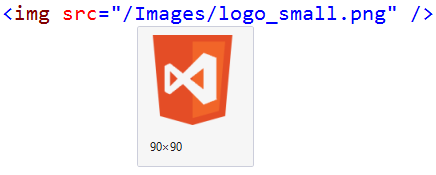
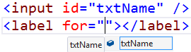

# Html Tools

[](https://ci.appveyor.com/project/madskristensen/htmltools)

Download this extension from the [VS Marketplace](https://marketplace.visualstudio.com/vsgallery/0f48200f-ea7d-4e82-b366-45c1965768a7)
or get the [CI build](http://vsixgallery.com/extension/3cef2919-d8c7-4e9f-a809-5a0ba9c61fac/).

---------------------------------------

Productivity tools for the HTML editor

See the [change log](CHANGELOG.md) for changes and road map.

## Features

- Image hover preview
- Go to definition of classes and IDs
- Peek definition
- Meta tag Intellisense
- Dynamic Intellisense
- Find all references
- Light bulbs
- Validation

### Image hover preview


### Go to definition
Hit `F12` when the cursor is located inside a class or ID attribute. 
HTML Tools will jump to the location inside CSS, LESS and Sass files. 

### Peek definition
Hit `Alt+F12` when the curser is located inside a class or ID attribute.
A peek definition inline code window will appear showing the definition
of the class/ID from CSS, LESS and Sass files.

### Meta tags
Full Intellisense provided for: 
- Apple iOS
- Twitter Cards
- Facebook/OpenGraph
- Windows 8
- Internet Explorer 9+
- Viewport

### Dynamic Intellisense
Dynamic Intellisense is where Intellisense is based on other tags and attributes etc.
```html
<label for="here">
<input id="here" /> based on <label> tags
<datalist> IDs
```



### Find all references
Hit `Shift+F12` when the cursor is located inside a class attribute. 
HTML Tools will search all CSS, LESS and SASS files for the
class name. 

### Light bulbs
Light bulbs are added for variuos scenarios including:

- Base64 decoding of images
- Extract JavaScript to file 
- Remove parent tags 
- Extract Stylesheets to file 

### Validation

#### OpenGraph prefix
When working with Facebook/OpenGraph integration, we need to 
remember to add the prefix attribute to the `<head>` element. 

#### Microdata
Validates that the itemtype attribute is a valid absolute URL.

#### rel=logo
Validates that the `type` attribute has the value `image/svg`

## Contribute
Check out the [contribution guidelines](.github/CONTRIBUTING.md)
if you want to contribute to this project.

For cloning and building this project yourself, make sure
to install the
[Extensibility Tools 2015](https://visualstudiogallery.msdn.microsoft.com/ab39a092-1343-46e2-b0f1-6a3f91155aa6)
extension for Visual Studio which enables some features
used by this project.

## License
[Apache 2.0](LICENSE)